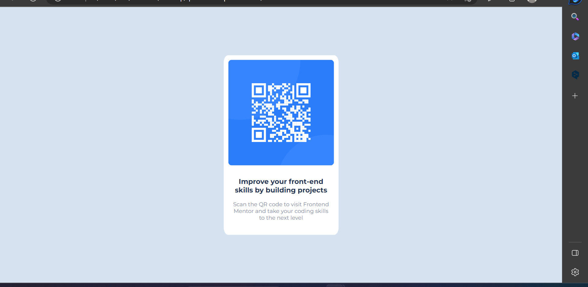

# Frontend Mentor - QR code component solution

This is a solution to the [QR code component challenge on Frontend Mentor](https://www.frontendmentor.io/challenges/qr-code-component-iux_sIO_H). Frontend Mentor challenges help you improve your coding skills by building realistic projects. 

## Table of contents

- [Overview](#overview)
  - [Screenshot](#screenshot)
  - [Links](#links)
- [My process](#my-process)
  - [Built with](#built-with)
  - [What I learned](#what-i-learned)
  - [Useful resources](#useful-resources)


## Overview

### Screenshot



### Links

- Live Site URL: https://grand-begonia-2842ee.netlify.app/

## My process

### Built with

- HTML5
- CSS 

### What I learned

```css
.new_css {
    position: absolute;
    top: 50%;
    left: 50%;
    transform: translate(-50%, -50%);
}
```
```css
.new_css{
    display: block;
    margin-left: auto;
    margin-right: auto;
}
```

### Useful resources

- [FreeCodeCamp - How to Center a Div with CSS](https://www.freecodecamp.org/news/how-to-center-a-div-with-css/) Good explanation for beginners
- [11 Ways to Center Div or Text in Div in CSS](https://blog.hubspot.com/website/center-div-css) - Also well explained


